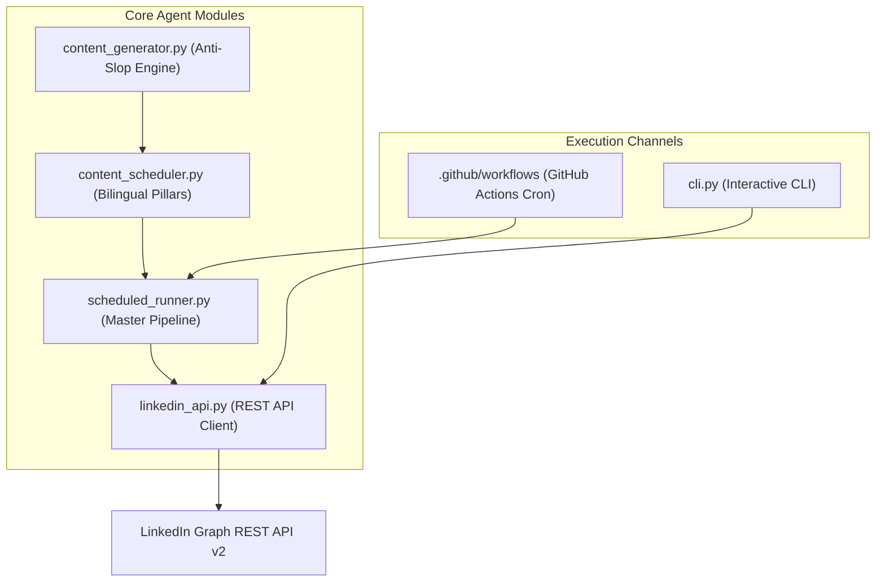

# LinkedIn Autonomous Growth & Content Agent 🚀

An enterprise-grade, anti-slop autonomous agent designed to research, draft, and publish high-authority workflow automation case studies and technical insights to LinkedIn via the official LinkedIn REST API v2.

---

## 📌 Features

* **Official REST API v2 & UGC Integration:** Fully compliant with LinkedIn developer policies (OAuth 2.0 with `w_member_social` & OpenID scopes). No browser scraping or account-risk automation.
* **Anti-Slop Content Engine:** Strict formatting filters that eliminate generic AI cliches, empty buzzwords, and robotic openers. Optimized for "...see more" cutoff clicks and spacious mobile readability.
* **Bilingual Strategy:**
  * **Indonesian Mode (`id`):** Targeted at regional business owners, agencies, and operational leaders.
  * **English Mode (`en`):** Targeted at global founders, engineering managers, and solopreneurs across US/EU/APAC.
* **Automated Weekly Pillars:**
  * *Monday:* Problem vs. Solution (Manual Workflows vs. Automation)
  * *Wednesday:* Real-World Technical Case Studies (WhatsApp Webhooks, Data Cleaners, AR Pipelines)
  * *Friday:* High-ROI System Architecture & Pragmatic Engineering Takes
* **Hands-Free Cloud Automation:** Pre-configured GitHub Actions workflow for scheduled daily publishing during peak engagement windows.

---

## 🏗️ Architecture



---

## 🚀 Quick Start

### 1. Installation
```bash
# Clone the repository
git clone https://github.com/your-username/linkedin-agent.git
cd linkedin-agent
```

### 2. Connect Your LinkedIn Account
Run the automated OAuth setup script:
```bash
python setup_token.py
```
This launches your browser, authenticates your account, and updates your `.env` configuration automatically.

### 3. Test & Preview
```bash
# Preview today's post in Indonesian
python cli.py preview --lang id

# Preview today's post in English
python cli.py preview --lang en

# Publish today's post
python cli.py publish --lang id
```

---

## 📄 License
MIT License. Built for high-efficiency developers and technical solopreneurs.
